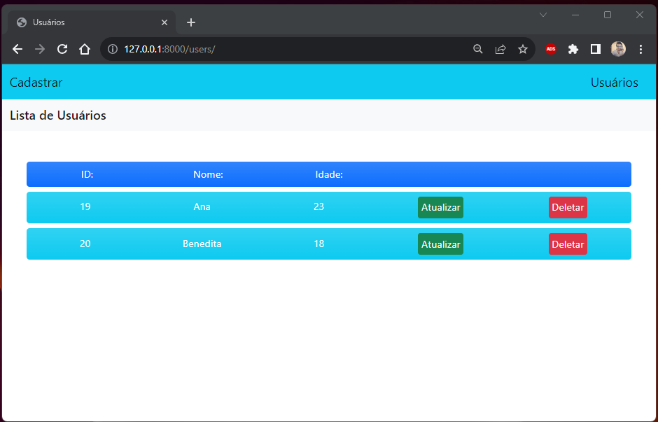

# Projeto DJango com Bootstrap 5
## Projeto simples usando conceitos CRUD (Create, Read, Update e Delete)

* para instalar as dependências do projeto:
        pip install -r requirements.txt

* depois dentro da pasta do projeto rode com:
        python3 manage.py runserver

* pode ser que precise fazer as migrations

## Fabio Carneiro
